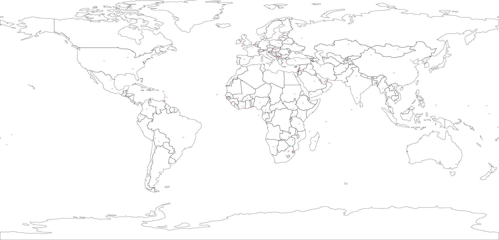
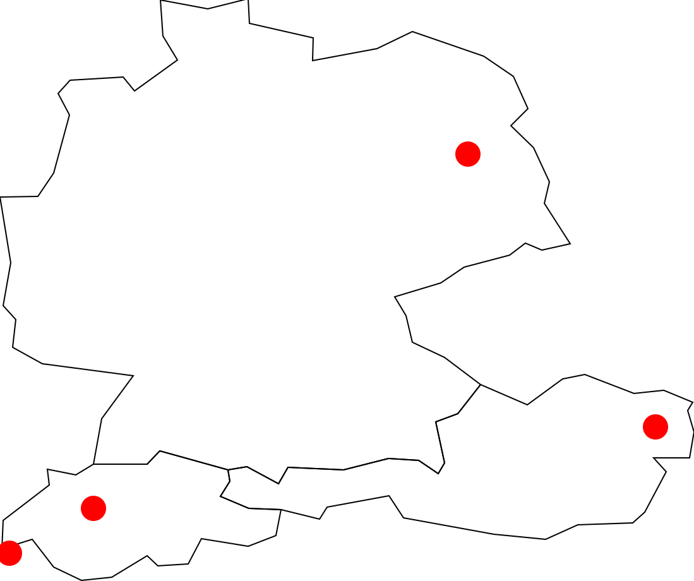

# `shp2svg`

A tool to convert shapefiles to SVG.

## Installation

1) [Download and install Go](https://golang.org/dl/) and [proj](https://proj.org/en/9.3/install.html); then,
2) Run `go install github.com/everystreet/shp2svg/cmd/shp2svg@latest`.

## Usage

The examples in this section utilize public domain [Natural Earth](https://www.naturalearthdata.com/) datasets.

By default `shp2svg` renders all shapes in the provided shapefiles. Shapefiles must be provided in the form of ZIP files, and must contain `.dbf` and `.shp` files.

```bash
shp2svg -s 10 -d world.svg -z ne_110m_admin_0_countries.zip -z ne_110m_populated_places.zip
```

The example above renders the following SVG:



Filters can be applied by referencing shapefile attributes. The example below uses the same datasets as above, but renders only the countries and cities in the DACH region.

```bash
shp2svg -s 100 -d dach.svg -z ne_110m_admin_0_countries.zip -f NAME_EN=[Germany,Austria,Switzerland] -z ne_110m_populated_places.zip -f NAME=[Berlin,Vienna,Bern,Geneva]
```



Note that `-f NAME_EN=[Germany,Austria,Switzerland]` is semantically equivalent to `-f NAME_EN=Germany -f NAME_EN=Austria -f NAME_EN=Switzerland`, but is somewhat less verbose. The square brackets are only necessary when multiple values for the same field are listed inside the same `-f` argument.
